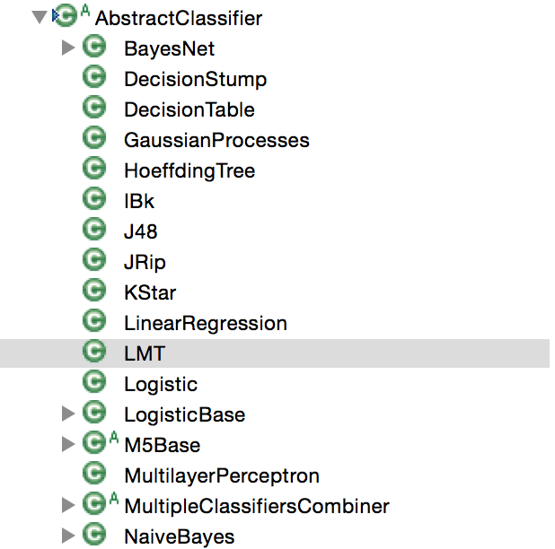
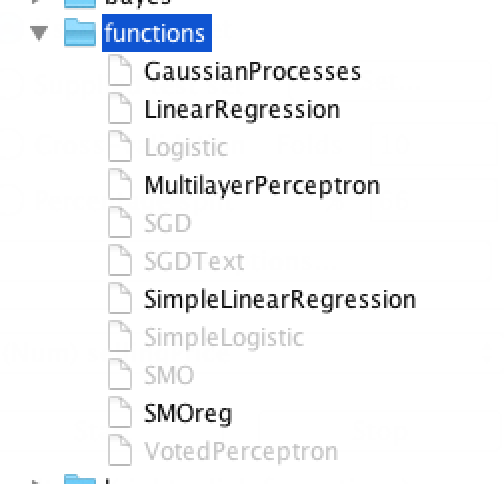

# AbstractClassifer



Weka中的分类器都继承自此类，下面对这个类进行详细的剖析，先从导入的包讲起，这里只导入了三个Java的基础库。

```java
import java.io.Serializable;	// 用于对象的序列化
import java.util.Enumeration;	// 类似于Iterator，输出分类器的选项时用到
import java.util.Vector;		// 用Vector来保存选项

import weka.core.*;				// 导入了core下的所有包，用到时再说明
```

再看看这个类都继承了哪些接口。

```java
public abstract class AbstractClassifier implements Classifier, Cloneable,
  Serializable, OptionHandler, CapabilitiesHandler, RevisionHandler,
  CapabilitiesIgnorer {
 }
```
继承了很多个接口，下面挑选重要的说明。最重要的肯定是Classfier这个接口，来看看它的代码。

```java
// 所有的分类器都要继承此接口，
// 一个分类器至少要实现这里定义的classifyInstance()或distributionForInstance()二者之一
public interface Classifier ｛
	// 用于训练分类器，实现时要注意两点：
	// 1. 初始化没有被设定的参数；2. 训练时不能改变Instance的内容
	public abstract void buildClassifier(Instances data) throws Exception;
	// 对一个instance输出其所属的类型
	public double classifyInstance(Instance instance) throws Exception;
	// 对于多分类器，输出每个分类器的概率？待验证
	public double[] distributionForInstance(Instance instance) throws Exception;
	public Capabilities getCapabilities();
}
```
对于最后一个`getCapabilities()`方法，GUI中，对于不同的数据，总会有一些分类器显示为灰色，即不能使用，如图所示，就是通过设置Capabilities来实现的。


其他的几个接口，`Clonable`, `Serializable`, `RevisionHandler`前面已经提到，`OptionHandler`显然是用来处理分类器的选项的，`CapabilitiesHandler`以及`CapabilitiesIgnorer`则是与前面提到的`Capabilities`类有关。

`AbstractClassifier`是所有分类器的公共父类，这里虽然实现了很多方法，然而大多都是一些判断参数是否标准之类的操作，对于一个分类器来说最重要的几个方法（即`Classfier`接口中定义的方法）都会由子类重新实现。

## 本文中涉及到的类
`AbstractClassifier`, `Classifier`, `Capabilities`


## TODO
Enumeration和Iterator的对比
Vector

## 参考资料
[1] Weka源码