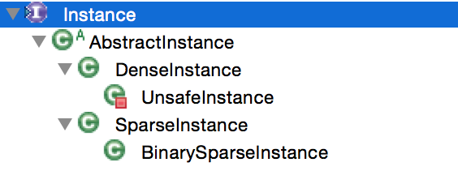

# Weka中的Instances类详解
Weka中会把读入的数据转化为Instances类的对象，然后进行处理。
而Intances类的对象其实是Instance的一个列表。

```java
public class Instances extends AbstractList<Instance> implements 
Serializable, RevisionHandler {
} 
```
实现Serializable接口用于序列化保存对象，RevisionHandler根据注释的说明是用于版本控制，然而现在并不理解具体有什么作用，不过这个暂时也不重要。
既然Instances是由Instance组成的列表，那就应该先看Instance的源码，先从Import的信息看起。

```java
package weka.core;				

import java.util.Enumeration;	//类似于Iterator, Java文档中也说明推荐使用Iterator，应该是个历史遗留问题，在输出所有属性(Attribute)时用到

// Instance是一个接口，Copyable类似于Java原生的clone，应该是用来实现自定义的clone
public interface Instance extends Copyable {
}
```
Instance是一个接口，那就来看一下Instance的继承树。

Instance的方法由AbstractInstance来实现，因此我们只需关注AbstractInstance即可。

```java
  protected Instances m_Dataset;	//Instance所属的那个Instances, 可能在某些时候需要用到，暂时没想到使用场景
  protected double[] m_AttValues;	//所有属性的值，都被保存成了double
  protected double m_Weight;//本条数据的权重
```
对于m_Weight属性，比如在朴素贝叶斯分类器中就会用到

```java
  public void addValue(double data, double weight) {
    m_Counts[(int) data] += weight;	
    m_SumOfCounts += weight;
  } 
```
到这里，我们对于Weka中存储数据的结构已经有了一定的认识，下面以前面用过的house数据为例，说明类与数据的对应关系。

```
@RELATION house

@ATTRIBUTE houseSize NUMERIC
@ATTRIBUTE lotSize NUMERIC
@ATTRIBUTE bedrooms NUMERIC
@ATTRIBUTE granite NUMERIC
@ATTRIBUTE bathroom NUMERIC
@ATTRIBUTE sellingPrice NUMERIC

@DATA
3529,9191,6,0,0,205000 
3247,10061,5,1,1,224900 
4032,10150,5,0,1,197900 
2397,14156,4,1,0,189900 
2200,9600,4,0,1,195000 
3536,19994,6,1,1,325000 
2983,9365,5,0,1,230000
```
`@DATA`中所有的内容就对应于Instances，而其中的每一行比如`3529,9191,6,0,0,205000 `就对应于Instance, `@ATTRIBUTE`就对应于Attribute类，含有该属性的类型和名称信息。

下面介绍一下每一类属性在Attribute中是怎么进行存储的。

```java
  protected final String m_Name;	//保存了属性的名称，对应例子中的houseSize
  protected int m_Type;				//保存了属性的类型，对应例子中的NUMERIC
```
Attribute中最重要的属性就是m\_Type，它是通过不同的构造函数设置的。

```java
```


## 本文中涉及到的Weka中的类
Instances, Instance, AbstractInstance, Attribute

## 参考资料
[1] Java Doc


## TODO
RevisionHandler的使用？
Copyable