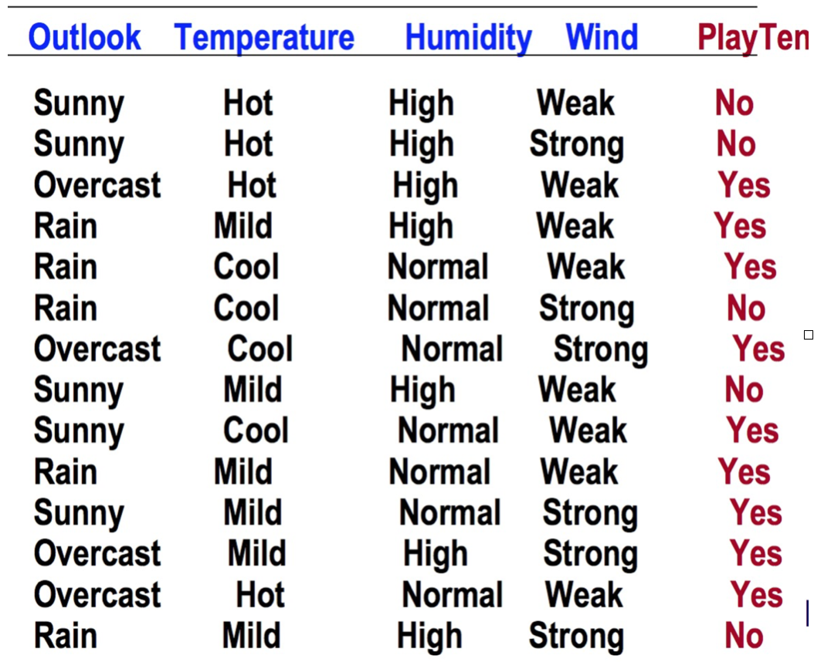
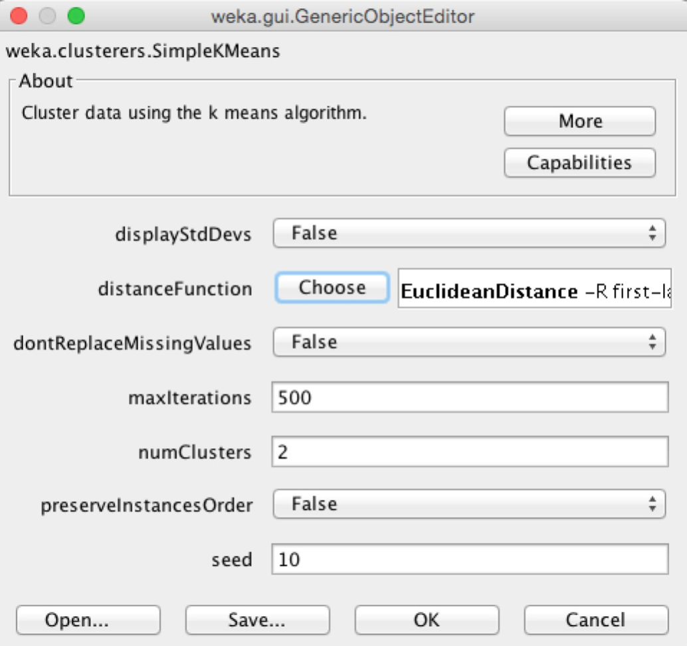
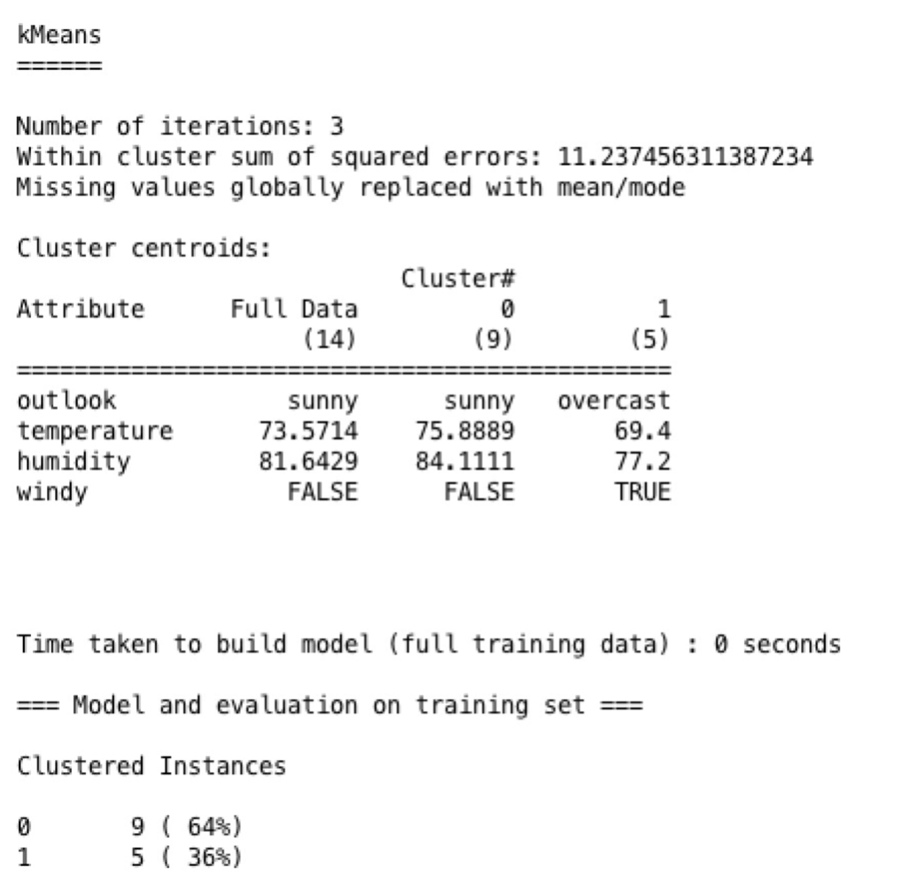

# Kmeans算法

## 算法介绍
### 什么是Kmeans
就是将K个点，称为中心点（K需要预先给出），随机的放到数据集中，然后针对数据集中的每个点计算与这K个中心点的距离，找到每个点最近的中心点。然后更新这K个中心点，使每个中心点是最近的点的平均中心点。如此循环，直到这K个点的位置不能再移动，得到K个聚类。
### Kmeans算法流程
1.随机选择k个对象，每个对象代表一个簇的初始均值或中心
2.对剩余的每个对象，根据它与簇均值的距离，将他指派到最相似的簇
3.计算每个簇的新均值
4.回到步骤2，循环，直到准则函数收敛变化的趋势越陡。

## 在Weka中使用

用SimpleKMeans算法根据外面的天气，温度，湿度，风力大小等推测出打不打球。



需要输入的参数：

- displayStdDevs:输出中是否显示标准差。
- distanceFunction:选择计算距离的方法有ChebyshevDistance,EditDistance,EuclideanDistance,ManhattanDistance这四种方法可选。
- dontReplaceMissingValues:是否要替代空缺值。
- maxIterations:指定最大迭代次数。
- numClusters:指定族的数目。
- preserveInstancesOrder:集的实例是否必须保留下来。
- seed:初始总数。



输出：




## 算法重点
moveCentroid代码：
把质心转移到它的新坐标。生成基于这个新质心坐标的族成员(与哪个质心更近就把点对象分配给哪个质心的族)会使用到不同的距离函数计算。

```java
 protected double[] moveCentroid(int centroidIndex, Instances members,
    boolean updateClusterInfo, boolean addToCentroidInstances) {
    
    double[] vals = new double[members.numAttributes()];
    double[][] nominalDists = new double[members.numAttributes()][];
    double[] weightMissing = new double[members.numAttributes()];
    double[] weightNonMissing = new double[members.numAttributes()];
    for (int j = 0; j < members.numAttributes(); j++) {
      if (members.attribute(j).isNominal()) {
        nominalDists[j] = new double[members.attribute(j).numValues()];
      }
    }
   
	//省略部分代码

    //如果是利用曼哈顿距离进行计算，需要用中位数代替均值。
    if (m_DistanceFunction instanceof ManhattanDistance) {
      Instances sortedMembers = null;
      int middle = (members.numInstances() - 1) / 2;//得到样本数的中间值
      boolean dataIsEven = ((members.numInstances() % 2) == 0);//判断样本数是不是一个偶数
      if (m_PreserveOrder) {
        sortedMembers = members;
      } else {
        sortedMembers = new Instances(members);
      }
      for (int j = 0; j < members.numAttributes(); j++) {
        if ((weightNonMissing[j] > 0) && members.attribute(j).isNumeric()) {
          if (members.numInstances() == 1) {
            vals[j] = members.instance(0).value(j);
          } else {
            vals[j] = sortedMembers.kthSmallestValue(j, middle + 1);
            if (dataIsEven) {
              vals[j] = (vals[j] + sortedMembers.kthSmallestValue(j, middle + 2)) / 2;
            }
          }
        }
      }
    }
    //更新同一族中的点  
    if (updateClusterInfo) {   
      for (int j = 0; j < members.numAttributes(); j++) {
        m_ClusterMissingCounts[centroidIndex][j] = weightMissing[j];
        m_ClusterNominalCounts[centroidIndex][j] = nominalDists[j];
      } 
    }
    
    if (addToCentroidInstances) {
      m_ClusterCentroids.add(new DenseInstance(1.0, vals));
    }
    
    return vals;
  }

```
coder在求middle的时候用的是(members.numInstances() - 1) / 2;这样如果是偶数实际求出来的middle就小1，然后是因为数数是从0数起，所以是偶数的是时候用的是middle+2。kthSmallestValue找出第kth个最小值，就是中位数。

<br>
buildClusterer代码：
建立族的过程。

```java
m_ClusterNominalCounts = new double[m_NumClusters][instances.numAttributes()][];
    m_ClusterMissingCounts = new double[m_NumClusters][instances.numAttributes()];
    if (m_displayStdDevs) {
      m_FullStdDevs = instances.variances();
    }
   
    m_FullMeansOrMediansOrModes = moveCentroid(0, instances, true, false);  
 	m_FullMissingCounts = m_ClusterMissingCounts[0];
    m_FullNominalCounts = m_ClusterNominalCounts[0];
    double sumOfWeights = instances.sumOfWeights();
    for (int i = 0; i < instances.numAttributes(); i++) {
      if (instances.attribute(i).isNumeric()) {
        if (m_displayStdDevs) {
          m_FullStdDevs[i] = Math.sqrt(m_FullStdDevs[i]);
        }
        if (m_FullMissingCounts[i] == sumOfWeights) {
          m_FullMeansOrMediansOrModes[i] = Double.NaN; // 如果这个属性全是缺失值，就把它标记为NaN
        }
      } else {
        if (m_FullMissingCounts[i] > m_FullNominalCounts[i][Utils
          .maxIndex(m_FullNominalCounts[i])]) {
          m_FullMeansOrMediansOrModes[i] = -1; //如果是缺失值比别的有的离散值还多，标志为-1
        }
      }
}

```
这里调用了前面的moveCentroid代码，这里有一个显示标准差的一个boolean变量，得到数据集的第i个属性的方差开方，如果这个属性全是缺失值，就把它标记为NaN。再下来，如果是缺失值比别的有的离散值还多，标志为-1。 

```java
m_ClusterCentroids = new Instances(instances, m_NumClusters);
    int[] clusterAssignments = new int[instances.numInstances()];

    if (m_PreserveOrder) {
      m_Assignments = clusterAssignments;
    }

    m_DistanceFunction.setInstances(instances);

    Random RandomO = new Random(getSeed());
    int instIndex;
    HashMap<DecisionTableHashKey, Integer> initC =
      new HashMap<DecisionTableHashKey, Integer>();
    DecisionTableHashKey hk = null;

    Instances initInstances = null;
    if (m_PreserveOrder) {
      initInstances = new Instances(instances);
    } else {
      initInstances = instances;
    }

    if (m_speedUpDistanceCompWithCanopies) {
      m_canopyClusters = new Canopy();
      m_canopyClusters.setNumClusters(m_NumClusters);
      m_canopyClusters.setSeed(getSeed());
      m_canopyClusters.setT2(getCanopyT2());
      m_canopyClusters.setT1(getCanopyT1());
      m_canopyClusters
        .setMaxNumCandidateCanopiesToHoldInMemory(getCanopyMaxNumCanopiesToHoldInMemory());
      m_canopyClusters.setPeriodicPruningRate(getCanopyPeriodicPruningRate());
      m_canopyClusters.setMinimumCanopyDensity(getCanopyMinimumCanopyDensity());
      m_canopyClusters.setDebug(getDebug());
      m_canopyClusters.buildClusterer(initInstances);
      // System.err.println(m_canopyClusters);
      m_centroidCanopyAssignments = new ArrayList<long[]>();
      m_dataPointCanopyAssignments = new ArrayList<long[]>();
    }

    if (m_initializationMethod == KMEANS_PLUS_PLUS) {
      kMeansPlusPlusInit(initInstances);

      m_initialStartPoints = new Instances(m_ClusterCentroids);
    } else if (m_initializationMethod == CANOPY) {
      canopyInit(initInstances);

      m_initialStartPoints = new Instances(m_canopyClusters.getCanopies());
    } else if (m_initializationMethod == FARTHEST_FIRST) {
      farthestFirstInit(initInstances);

      m_initialStartPoints = new Instances(m_ClusterCentroids);
    } else {
      // random
      for (int j = initInstances.numInstances() - 1; j >= 0; j--) {
        instIndex = RandomO.nextInt(j + 1);
        hk =
          new DecisionTableHashKey(initInstances.instance(instIndex),
            initInstances.numAttributes(), true);
        if (!initC.containsKey(hk)) {
          m_ClusterCentroids.add(initInstances.instance(instIndex));
          initC.put(hk, null);
        }
        initInstances.swap(j, instIndex);

        if (m_ClusterCentroids.numInstances() == m_NumClusters) {
          break;
        }
      }

```
m_ClusterCentroids初始化大小为m_NumClusters，用DecisionTableHashKey产生随机得到的instance，如果这个样本以前就被加入过中心点集合中，当然就不再加了，如果不是就加入，并加入它的key，initC.put(hk, null)，循环直到用户指定的中心点数的中心点都被初始指定。

```java
 while (!converged) {
      if (m_speedUpDistanceCompWithCanopies) {
        // 重新分配当前族的集群中心
        m_centroidCanopyAssignments.clear();
        for (int kk = 0; kk < m_ClusterCentroids.numInstances(); kk++) {
          m_centroidCanopyAssignments.add(m_canopyClusters
            .assignCanopies(m_ClusterCentroids.instance(kk)));
        }
      }

      emptyClusterCount = 0;
      m_Iterations++;// 记录迭代的次数
      converged = true;

      if (m_executionSlots <= 1
        || instances.numInstances() < 2 * m_executionSlots) {
        for (i = 0; i < instances.numInstances(); i++) {
          Instance toCluster = instances.instance(i);
          int newC =
            clusterProcessedInstance(
              toCluster,
              false,
              true,
              m_speedUpDistanceCompWithCanopies ? m_dataPointCanopyAssignments
                .get(i) : null);
          if (newC != clusterAssignments[i]) {
            converged = false;
          }
          clusterAssignments[i] = newC;
        }
      } else {
        converged = launchAssignToClusters(instances, clusterAssignments);
}
// m_Iterations是记录迭代了多少次，这里对所有的数据进行循环，如果clusterProcessedInstance得到的新的簇和以前得到的不一样，也就是说还没有收敛。那么就把这个簇赋给clusterAssignments[i]。 

      // 更新质心
      m_ClusterCentroids = new Instances(instances, m_NumClusters);
      for (i = 0; i < m_NumClusters; i++) {
        tempI[i] = new Instances(instances, 0);
      }
      for (i = 0; i < instances.numInstances(); i++) {
        tempI[clusterAssignments[i]].add(instances.instance(i));
      }
      if (m_executionSlots <= 1
        || instances.numInstances() < 2 * m_executionSlots) {
        for (i = 0; i < m_NumClusters; i++) {
          if (tempI[i].numInstances() == 0) {
            // 空族
            emptyClusterCount++;
          } else {
            moveCentroid(i, tempI[i], true, true);
          }
        }
      } else {
        emptyClusterCount = launchMoveCentroids(tempI);
      }

      if (m_Iterations == m_MaxIterations) {
        converged = true;
      }
// 判断是不是到了指定的最大迭代数，是的话就设为收敛。

      if (emptyClusterCount > 0) {
        m_NumClusters -= emptyClusterCount;
        if (converged) {
          Instances[] t = new Instances[m_NumClusters];
          int index = 0;
          for (int k = 0; k < tempI.length; k++) {
            if (tempI[k].numInstances() > 0) {
              t[index] = tempI[k];

              for (i = 0; i < tempI[k].numAttributes(); i++) {
                m_ClusterNominalCounts[index][i] = m_ClusterNominalCounts[k][i];
              }
              index++;
            }
          }
          tempI = t;
        } else {
          tempI = new Instances[m_NumClusters];
        }
      }

// termI是记录每个簇里的样本的，termI[clusterAssignments[i]]就是第clusterAssignments[i]个簇的样本集，第三个for循环的意思是如果一个簇是空的，将记录空簇的变量emptyClusterCount累加，或用moveCentroid移动中心点。再下面，如果有空簇，改变m_NumClusters的数量，如果收敛了，那么就把不是空数据集的数据集放到termpI中，没有收敛就只是改变tempI的大小。 

      if (!converged) {
        m_ClusterNominalCounts = new double[m_NumClusters][instances.numAttributes()][0];
      }
    }
// 如果族还没有收敛，那么重置这两个变量。 

```

```java
private int clusterProcessedInstance(Instance instance, boolean updateErrors,
    boolean useFastDistCalc, long[] instanceCanopies) {
    double minDist = Integer.MAX_VALUE;
    int bestCluster = 0;
    for (int i = 0; i < m_NumClusters; i++) {
      double dist;
      if (useFastDistCalc) {
        if (m_speedUpDistanceCompWithCanopies && instanceCanopies != null
          && instanceCanopies.length > 0) {
          try {
            if (!Canopy.nonEmptyCanopySetIntersection(
              m_centroidCanopyAssignments.get(i), instanceCanopies)) {
              continue;
            }
          } catch (Exception ex) {
            ex.printStackTrace();
          }
          dist =
            m_DistanceFunction.distance(instance,
              m_ClusterCentroids.instance(i), minDist);
        } else {
          dist =
            m_DistanceFunction.distance(instance,
              m_ClusterCentroids.instance(i), minDist);
        }
      } else {
        dist =
          m_DistanceFunction.distance(instance, m_ClusterCentroids.instance(i));
      }
      if (dist < minDist) {
        minDist = dist;
        bestCluster = i;
      }
    }
    if (updateErrors) {
      if (m_DistanceFunction instanceof EuclideanDistance) {
        // Euclidean distance to Squared Euclidean distance
        minDist *= minDist * instance.weight();
      }
      m_squaredErrors[bestCluster] += minDist;
    }
    return bestCluster;
  }
// 在m_NumClusters中找与这个样本最近的中心点，返回。如果要更新误差，就将误差累加到squaredErrors上。 

  public int clusterInstance(Instance instance) throws Exception {
    Instance inst = null;
    if (!m_dontReplaceMissing) {
      m_ReplaceMissingFilter.input(instance);
      m_ReplaceMissingFilter.batchFinished();
      inst = m_ReplaceMissingFilter.output();
    } else {
      inst = instance;
    }

    return clusterProcessedInstance(inst, false, true, null);
  }
// 样本是哪个族
```