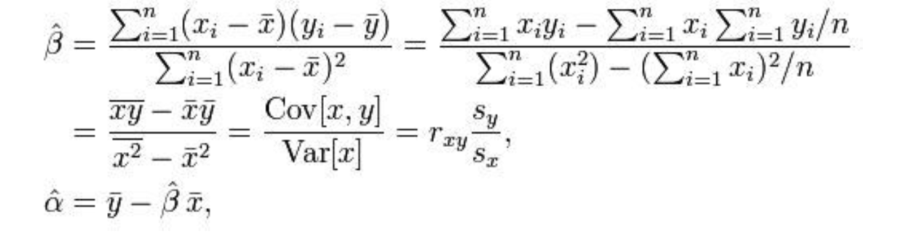

# Linear Regression
## 算法介绍
Linear Regression是。。。。

在很多的机器学习课程（比如Andrew Ng在Coursera上的Machine Learning公开课）中，都以它作为讲解的第一个算法，它是很多算法（比如逻辑斯蒂回归，神经网络算法）的基础。

在Weka中，有两个相应的实现，SimpleLinearRegression类实现了单变量的线性回归，LinearRegression则是多变量的线性回归的实现。

## 在Weka中使用
前面提到Weka中有两种线性回归的实现。


## 算法重点
### SimpleLinearRegression
$$f(n) = x * 2$$
$f(n)=x^2$
$$ f(n) = x ^ 2 $$


```java
//
```


## 参考文献
[1] http://en.wikipedia.org/wiki/Simple_linear_regression